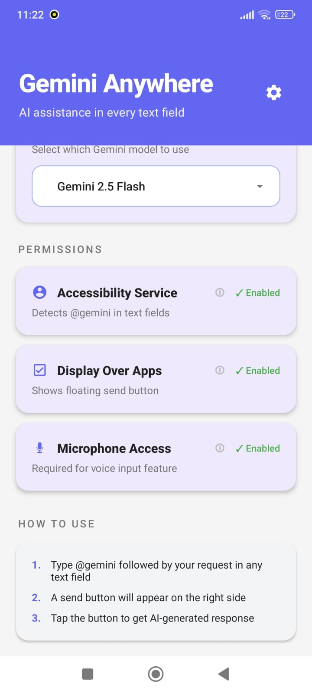
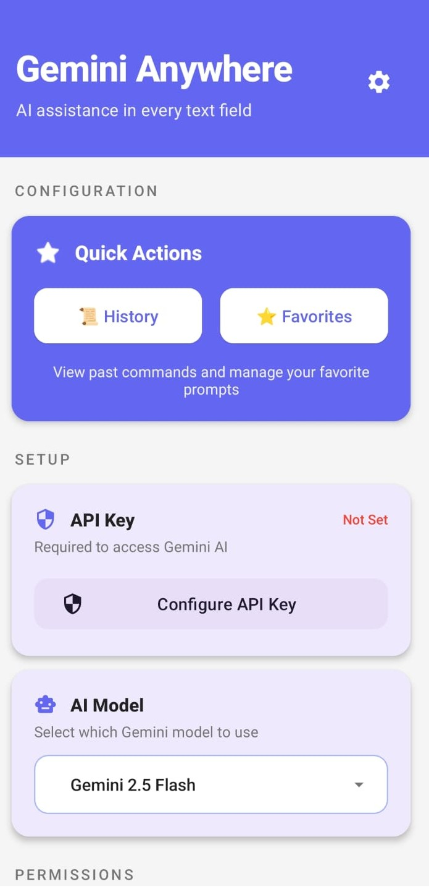
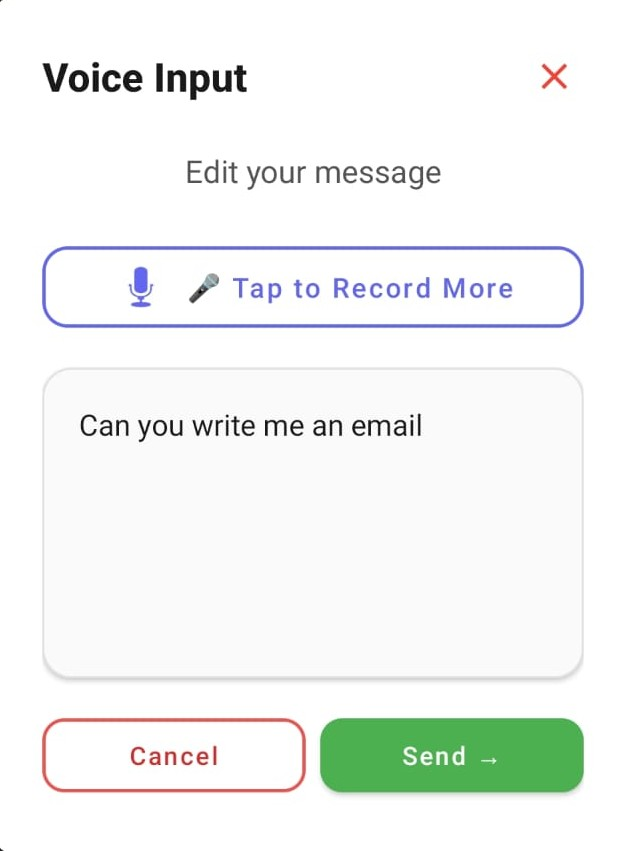
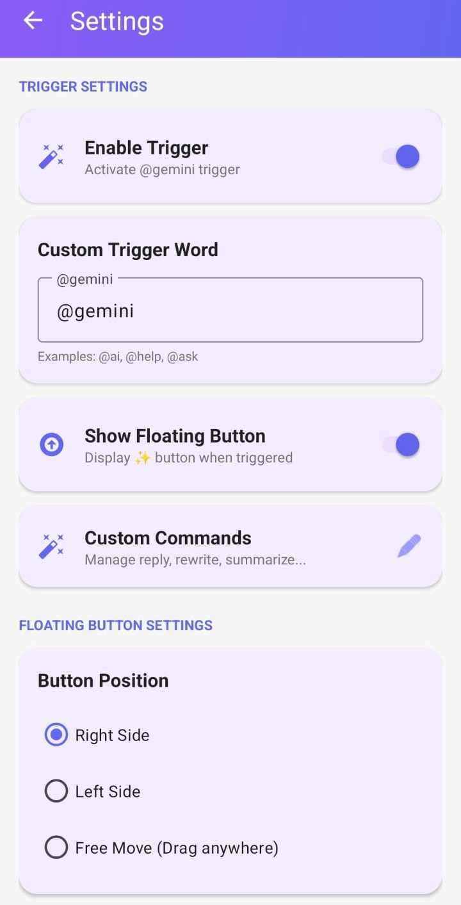
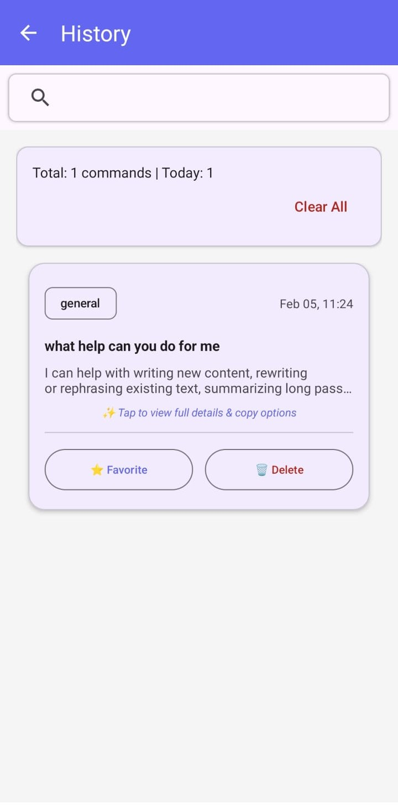

# 🚀 Gemini Anywhere

<div align="center">

[](https://github.com/barathvasan-dev/Gemini-Anywhere/releases)
[](LICENSE)
[](https://developer.android.com)
[](https://ai.google.dev)

**Transform any text field into an AI-powered assistant with just @gemini**

[Download APK](https://github.com/barathvasan-dev/Gemini-Anywhere/releases) • [Report Bug](https://github.com/barathvasan-dev/Gemini-Anywhere/issues) • [Request Feature](https://github.com/barathvasan-dev/Gemini-Anywhere/issues)

</div>

---

## 💡 The Problem

Ever wished you could access powerful AI assistance **anywhere** on your Android device? 

- 📧 Writing emails? Get AI help instantly
- 💬 Chatting with friends? Generate creative responses
- 📝 Taking notes? Expand your ideas with AI
- 🌐 Browsing? Summarize content on-the-fly

**The friction?** Switching between apps, copying text, and breaking your flow just to get AI assistance.

## ✨ The Solution

**Gemini Anywhere** brings Google's latest **Gemini 3 API** directly into **every text field** on your Android device. No app switching. No copying and pasting. Just pure productivity.

Simply type `@gemini` followed by your command in ANY app, and watch the magic happen.

## 🎯 Key Features

### 🎤 **Voice-First Experience**
- **Material Design 3** voice input with stunning waveform animations
- Real-time transcription with 7-bar audio visualization
- "Record More" feature to build complex, multi-part prompts
- Professional UI with smooth transitions and pulse effects

### ⚡ **Universal Integration**
- Works in **every app**: WhatsApp, Gmail, Notes, Chrome, Twitter, and more
- Floating overlay button for quick access
- Accessibility service integration for seamless operation
- Non-intrusive design that respects your workflow

### 🎨 **Powerful Customization**
- **Custom Commands**: Create reusable prompt templates
- **Trigger Words**: Personalize your activation keyword (default: @gemini)
- **Favorites**: Save frequently used prompts for one-tap access
- **History**: Track and reuse your command history
- **Multi-language Support**: English, Spanish, French, German, Japanese

### 🤖 **Gemini 3 API Integration**
- **Latest Gemini 3 Pro models** for superior responses
- Support for multiple model variants:
  - Gemini 3 Pro Preview
  - Gemini 3 Flash Preview
  - Gemini 2.5 Pro & Flash
  - And 8+ text-optimized models
- Real-time streaming responses
- Context-aware conversations

### 🛡️ **Privacy & Security**
- **Local-first**: All data stored securely on your device
- Encrypted API key storage with Android Security Crypto
- No data collection or telemetry
- Transparent permissions model
- Open-source and auditable

## 📱 Screenshots

<div align="center">

### Main Interface & Permissions
  

### Voice Input Experience
    

### Advanced Features
    

</div>

## 🚀 Getting Started

### Prerequisites

- Android 7.0 (API 24) or higher
- Google Gemini API key ([Get one here](https://makersuite.google.com/app/apikey))

### Installation

1. **Download the APK** from [Releases](https://github.com/barathvasan-dev/Gemini-Anywhere/releases/latest)
2. **Install** the APK on your Android device
3. **Grant permissions**:
   - Accessibility Service: Monitor text fields
   - Display Over Apps: Show floating overlay
   - Microphone: Voice input (optional)

### Setup

1. **Launch** Gemini Anywhere
2. **Enter your Gemini API key** in the main screen
3. **Enable Accessibility Service** (Settings → Accessibility → Gemini Anywhere)
4. **Allow Display Over Apps** permission
5. **You're ready!** Type `@gemini` in any text field

## 🎮 Usage Examples

### Basic Usage
```
@gemini summarize this article
@gemini translate to Spanish
@gemini make this more professional
```

### Voice Commands
```
@gemini voice [Speak your command]
```

### Custom Commands
Create templates like:
- `/translate {text}` → "Translate the following to Spanish: {text}"
- `/code {text}` → "Write clean, documented code for: {text}"
- `/email {text}` → "Write a professional email about: {text}"

## 🔧 Architecture

### Tech Stack
- **Language**: Kotlin
- **UI**: Material Design 3, View Binding
- **Async**: Kotlin Coroutines & Flow
- **Network**: Retrofit 2, OkHttp
- **Security**: AndroidX Security Crypto
- **Architecture**: Service-based with MVVM patterns

### Core Components
1. **GeminiAccessibilityService**: Monitors text fields and detects trigger words
2. **FloatingOverlayService**: Manages floating button and voice UI overlay
3. **VoiceInputHandler**: Handles speech recognition and transcription
4. **GeminiApiClient**: Communicates with Gemini 3 API

### API Integration
This app uses **Google's Gemini 3 API** 
Key benefits:
- **Superior reasoning** and contextual understanding
- **Faster responses** with streaming support
- **Better multilingual** capabilities
- **Advanced code generation** and technical tasks

## 🛠️ Development

### Build from Source

```bash
# Clone the repository
git clone https://github.com/barathvasan-dev/Gemini-Anywhere.git
cd Gemini-Anywhere

# Build debug APK
./gradlew assembleDebug

# Build release APK (requires keystore)
./gradlew assembleRelease
```

### Project Structure
```
app/src/main/
├── java/com/geminianywhere/app/
│   ├── api/          # Gemini API client
│   ├── service/      # Background services
│   ├── ui/           # Activities & UI
│   └── utils/        # Utilities & helpers
└── res/
    ├── layout/       # XML layouts
    ├── drawable/     # Icons & graphics
    └── values/       # Strings & themes
```

## 🤝 Contributing

We welcome contributions! Here's how you can help:

1. **Fork** the repository
2. **Create** a feature branch (`git checkout -b feature/AmazingFeature`)
3. **Commit** your changes (`git commit -m 'Add some AmazingFeature'`)
4. **Push** to the branch (`git push origin feature/AmazingFeature`)
5. **Open** a Pull Request

### Areas to Contribute
- 🌍 **Translations**: Add support for more languages
- 🎨 **UI/UX**: Improve design and user experience
- 🐛 **Bug Fixes**: Report and fix issues
- 📚 **Documentation**: Improve guides and examples
- ✨ **Features**: Propose and implement new capabilities

## 📋 Roadmap

- [ ] Tablet optimization & landscape mode
- [ ] Widget support for quick access
- [ ] Preset command library
- [ ] Cloud sync for commands (optional, privacy-focused)
- [ ] Plugin system for custom integrations
- [ ] Wear OS companion app

## 🔒 Security

We take security seriously:

- ✅ **Encrypted storage** for API keys
- ✅ **No data collection** or analytics
- ✅ **Transparent permissions** with clear explanations
- ✅ **Open source** for community auditing
- ✅ **Regular security updates**

Found a security issue? Please email security@gemini-anywhere.dev (Do not open public issues)

## 📄 License

This project is licensed under the MIT License - see the [LICENSE](LICENSE) file for details.

## 🙏 Acknowledgments

- Google Gemini Team for the incredible API
- Android Developer community
- All contributors and testers
- Material Design team for design guidelines

## 📧 Contact & Support

- **Issues**: [GitHub Issues](https://github.com/barathvasan-dev/Gemini-Anywhere/issues)
- **Discussions**: [GitHub Discussions](https://github.com/barathvasan-dev/Gemini-Anywhere/discussions)
- **Twitter**: [@barathvasan-dev](https://twitter.com/barathvasan-dev)

---

<div align="center">

**Made with ❤️ by developers, for developers**

[⭐ Star this repo](https://github.com/barathvasan-dev/Gemini-Anywhere) if you find it useful!

</div>
